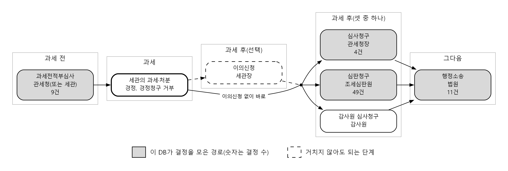
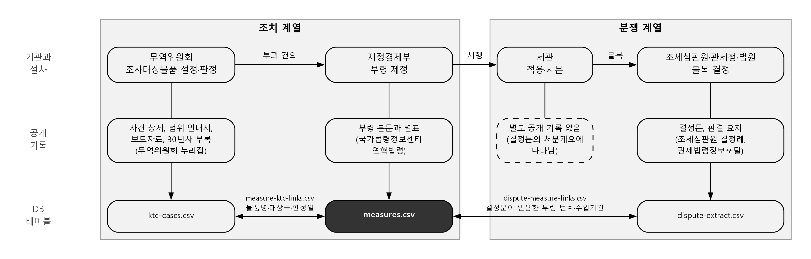
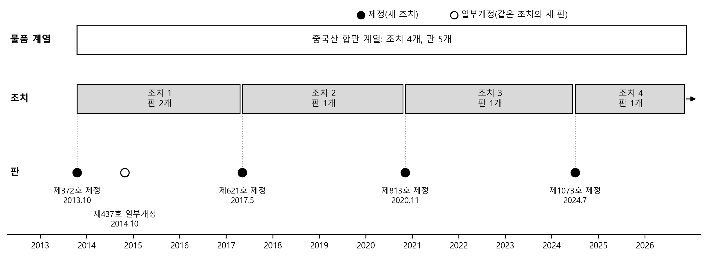

# 무역구제 조사범위 분쟁 DB — 구축 과정과 활용

작성일: 2026-09-27

## 요약

외국 기업이 물건을 제 나라에서보다 싸게 한국에 팔아 국내 산업이 피해를 입으면, 정부는 그 물건에 덤핑방지관세라는 관세를 추가로 붙인다. 어떤 물건에 붙일지는 무역위원회가 조사해서 정하고, 관세 정책 부처가 물건마다 규칙(부령)을 만들어 확정한다. 그런데 실제로 들어오는 물건은 규칙의 문장과 딱 맞아떨어지지 않는 경우가 많다. "이 물건도 관세 대상인가"를 두고 수입업체와 세관이 다투게 되는데, 그 다툼은 무역위원회가 아니라 세관, 관세청, 조세심판원, 법원에서 따로 처리되고 따로 기록된다. 이 DB는 흩어진 두 기록, 즉 무역위원회의 조사와 부령으로 관세를 부과한 기록과 그 뒤의 다툼 기록을 사건 단위로 이어 붙인 것이다. 1991년부터 2026년까지의 덤핑방지관세 조치 145개(부령 판 174개), 분쟁 결정 73건, 무역위원회 반덤핑조사 사건 229건을 담았고, 조치마다 범위를 정한 문장의 형식을 다섯 가지 유형으로 분류했으며, 분쟁 결정을 조치에, 그리고 그 조치를 무역위원회 사건에 연결했다.

DB로 확인한 사실은 네 가지다. 첫째, 다툼은 몇몇 물건에 몰려 있다. 조사범위를 다툰 결정 26건(결정문 22개, 분쟁 16개)은 145개 조치 가운데 23개, 92개 물품 계열 가운데 12개에만 걸려 있고, 그것도 같은 물건에 대한 연속 조치(중국·인도산 PET 필름, 중국산 합판, 중국산 도자기질 타일)에 몰려 있다. 둘째, 결정기관이 다툼을 판단한 기준은 "어디에 쓰느냐"(용도)가 아니라 "품목분류상 무엇이냐"였다. 26건 가운데 20건에서 HSK 품목분류가 판단 기준이었고, 용도가 기준이 된 것은 2건이다. 셋째, 무엇이 관세 대상인지가 규칙(부령)에 다 적혀 있지 않다. 무역위원회가 2019년 재심사에서 일정 규격의 합판 마루판을 대상에서 뺐지만 이 내용은 부령에 들어가지 않았고, 세관과 조세심판원은 부령이 아니라 무역위원회 판정에만 있는 이 규격으로 판단했다. 넷째, 품목분류 번호가 개정되면 부령에 적힌 대상 번호가 현실과 어긋난다. 2017년 개정 뒤 도자기질 타일 부령은 개정으로 없어진 번호를 대상으로 적은 채 시행되었다.

---

## I. 먼저 알아 둘 것

### 1. 덤핑방지관세란 무엇인가

수입품에 붙는 관세는 성격에 따라 두 종류로 나뉜다. 표 1은 평소에 늘 붙는 관세와 특별한 사정이 생겼을 때 덧붙이는 관세를 구분해 적은 것이다.

**표 1. 관세의 두 종류**

| 종류 | 무엇인가 | 적용 |
|---|---|---|
| 기본관세 | 관세율표에 품목별로 정해진 세율 | 평소에 늘 적용된다. 같은 품목이면 원칙적으로 같은 세율이고, FTA가 있으면 협정세율로 낮아진다 |
| 특수관세 | 특정한 사정이 생겼을 때 기본관세에 더하거나 기본관세를 바꾸어 매기는 관세 | 덤핑방지관세, 상계관세, 보복관세, 긴급관세, 조정관세, 할당관세 등 |

표의 특수관세는 관세법이 정한 것으로, 각각 다음과 같다. 앞의 네 가지는 외국의 행위나 수입 급증에 대응하는 관세이고, 뒤의 두 가지는 국내 사정에 맞추어 세율을 조정하는 관세다.

- 덤핑방지관세(관세법 제51조): 외국 물품이 정상가격보다 싸게 수입되어 국내 산업이 피해를 입을 때, 그 차이만큼까지 더 매기는 관세. 본 연구가 다루는 관세다.
- 상계관세(제57조): 외국 정부의 보조금을 받아 싸게 수입되는 물품에, 보조금만큼까지 더 매기는 관세.
- 보복관세(제63조): 상대국이 한국 수출품을 차별하는 등 불리하게 대우할 때, 그 나라 물품에 대응해 매기는 관세.
- 긴급관세(제65조): 공정한 거래라도 특정 물품의 수입이 갑자기 늘어 국내 산업이 심각한 피해를 입을 때 한시적으로 더 매기는 관세. 세이프가드라고도 한다.
- 조정관세(제69조): 세율 사이의 불균형을 바로잡거나 국민 건강, 환경, 소비자, 막 자라는 국내 산업을 보호하려고 일정 기간 기본세율보다 높여 매기는 관세.
- 할당관세(제71조): 물자를 원활하게 공급하려고 정한 수량까지는 세율을 낮춰 주고, 필요하면 그 수량을 넘는 수입에는 세율을 높이는 관세.

특수관세 가운데 외국에서 들어온 수입품 때문에 국내 산업이 피해를 입었을 때 그 피해를 바로잡으려고 쓰는 수단을 묶어 **무역구제**(貿易救濟, trade remedies)라고 부른다. WTO 회원국은 원칙적으로 약속한 세율보다 높은 관세를 물릴 수 없는데, WTO 협정은 세 가지 경우에 예외를 인정한다. 표 2는 그 세 가지 수단이 무엇에 대응하는지, 상대의 불공정 행위를 전제하는지, 한국에서 무엇이라 부르는지를 함께 적은 것이다.

**표 2. WTO가 허용하는 세 가지 무역구제**

| 수단 | 무엇에 대응하나 | 불공정 행위 전제 | 한국의 명칭 |
|---|---|---|---|
| 반덤핑 | 외국 기업이 자국 판매가격보다 싸게 수출하는 덤핑 | 있음(기업의 가격 행위) | 덤핑방지관세 |
| 상계 | 외국 정부의 보조금을 받아 싸진 수출품 | 있음(정부의 보조금) | 상계관세 |
| 세이프가드 | 공정한 거래라도 수입이 급증해 생긴 심각한 피해 | 없음 | 긴급관세 등 |

반덤핑과 상계는 불공정 무역에 대한 대응이므로 특정 국가, 특정 기업의 물품만 겨냥한다. 세이프가드는 불공정 행위를 전제하지 않으므로 원칙적으로 모든 나라의 수입품에 적용되고 요건이 더 엄격하다. 실제로 가장 많이 쓰이는 것은 반덤핑이다. 전 세계 무역구제 조치의 대부분이 반덤핑이며 한국도 같다. 이 DB도 반덤핑, 즉 **덤핑방지관세**만 다룬다.

**덤핑**은 수출가격이 그 물품의 정상가격보다 낮은 것을 말한다. 정상가격은 대개 수출국 안에서 팔리는 가격이다. 중국 공장이 합판을 중국 안에서는 100에 팔면서 한국에는 70에 판다면 차이 30이 덤핑이고, 30을 수출가격 70으로 나눈 값(약 43%)이 **덤핑률**이다. 다만 덤핑이 있다는 것만으로는 관세를 물릴 수 없고, 다음 세 가지 요건이 모두 필요하다.

1. 덤핑 사실이 있다.
2. 같은 종류의 물품을 만드는 국내 산업이 실질적 피해를 입었거나 입을 우려가 있다.
3. 덤핑과 피해 사이에 인과관계가 있다.

요건이 충족되면 덤핑률 범위 안에서 덤핑방지관세를 추가로 부과한다. 수출 기업이 가격을 올리겠다고 약속하는 **가격약속**으로 관세를 대신할 수도 있다. 부과 기간은 보통 5년이고, 끝날 무렵 연장이 필요한지 따지는 **종료재심사**를 거쳐 연장될 수 있다. 연장되면 같은 물건에 대한 규칙이 새로 만들어진다. 예를 들어 중국산 합판에는 2013년에 처음 덤핑방지관세가 붙었고, 2017년, 2020년, 2024년에 연장되면서 규칙이 모두 네 번 새로 제정되었다. 이 점은 V장에서 조치를 셀 때 다시 나온다.

### 2. 하나의 조치에 네 기관이 관여한다

하나의 덤핑방지관세 조치에는 여러 기관이 차례로 관여한다. 이 DB를 이해하려면 이 점을 먼저 알아야 하므로 시간 순서대로 따라간다. 처음은 **무역위원회**다. 국내 생산자(대개 해당 업종의 기업이나 협회)가 무역위원회에 조사를 신청한다. 무역위원회는 산업통상 담당 부처에 소속된 준사법적 합의제 기관이며, 한국에서는 덤핑 사실과 산업피해를 모두 이곳에서 조사한다. 조사를 시작할 때 무엇을 조사하는지, 즉 **조사대상물품**을 정해 공고한다. "중국산 합판, 두께 몇 mm 이상, 다만 이러저러한 규격은 제외" 같은 식이다. 이 DB가 말하는 **조사범위**(scope)의 출발점이 여기다. 이어서 예비판정(필요하면 잠정 관세를 건의), 본조사와 최종판정을 거쳐 덤핑률과 산업피해를 확정하고, 긍정 판정이면 관세 정책 부처 장관에게 덤핑방지관세 부과를 건의한다.

다음은 **부령**(部令)이다. 관세법 제51조는 덤핑방지관세를 부령(부처 장관이 내는 명령)으로 물품과 공급자 또는 공급국을 지정해 부과하도록 정한다. 그래서 조치마다 별도의 부령이 만들어지고, 제명(題名, 법령의 제목)은 "중국산 합판에 대한 덤핑방지관세 부과에 관한 규칙" 같은 꼴이다. 이 문서는 현재의 부처명을 따라 재정경제부령이라 부르고, 과거의 부령과 **회신**은 당시 부처명(기획재정부)으로 적는다. 조사범위가 법적으로 확정되는 곳이 이 부령의 문장이다. 무역위원회가 정한 조사대상물품이 부령에 옮겨 적히면서 법적 구속력을 얻는다. 표 3은 부령 한 편에 무엇이 들어가는지를 정리한 것이다.

**표 3. 덤핑방지관세 부령의 내용**

| 항목 | 내용 |
|---|---|
| 부과대상 물품 | 품목 서술과 HSK 번호(한국 관세율표의 10단위 분류번호) |
| 제외 물품 | 이러저러한 규격이나 형태는 대상이 아니라는 서술 |
| 공급자별 세율 | 조사에 협조한 기업별 세율과 "그 밖의 공급자" 세율 |
| 부과 기간 | 시행일과 종료일 |

세 번째는 세관이다. 부령이 시행되면 실제로 관세를 걷는 것은 세관이다. 수입자는 물품을 수입 신고할 때 세액을 스스로 계산해 신고하고 납부한다(**신고납부**). 세관은 신고를 심사하거나 나중에 조사해, 덤핑방지관세 대상인데 빠졌으면 추가로 부과한다(**경정**, 更正). 반대로 수입자가 덤핑방지관세를 냈지만 대상이 아니었다고 생각하면 돌려 달라고 청구할 수 있고(**경정청구**), 세관이 거부하면 그 거부가 다툼의 대상이 된다. 이 단계에서 세관은 개별 수입 물품을 부령의 문장과 비교해 대상인지 판단한다. 문장이 애매하면 여기서 판단이 갈리기 시작한다.

마지막은 불복 절차다. 수입자가 세관의 판단에 동의하지 않으면 불복 절차를 밟는다. 그림 1은 관세 분야의 불복 경로를 왼쪽에서 오른쪽으로 단계 순서대로 그린 것이다. 회색 테두리로 묶고 위에 이름을 단 것이 단계이고, 점선 상자는 거치지 않아도 되는 단계, 회색 상자는 이 DB가 결정을 모은 경로이며 상자 안의 숫자가 이 DB에 담긴 결정 수다.

**그림 1. 관세 분야의 불복 경로**

주: 과세전적부심사는 세관이 과세 예정을 통지한 경우에 세금이 매겨지기 전에 다투는 절차다. 행정소송은 과세 후의 불복 절차를 거친 뒤에 낼 수 있다.\
자료: `data/dispute-extract.csv`.

그림에서 보듯이 과세 후에는 **심사청구**(관세청장), **심판청구**(조세심판원), 감사원 심사청구의 세 가지 경로가 나란히 있고 수입자가 그중 하나를 고른다. 이의신청은 그 앞에 거칠 수도 있고 건너뛸 수도 있다. 그래서 조세심판원 자료만 보아서는 다툼을 다 모을 수 없고, 관세청의 결정과 법원 판결도 함께 모아야 한다(IV.2절). 결정의 수는 결정례 공개가 가장 충실한 조세심판원이 가장 많다. 같은 수입 거래가 **과세전적부심사**(課稅前適否審査)에서 심판청구를 거쳐 행정소송까지 가면 결정이 세 건 생기는데, V.4절에서는 이렇게 이어진 결정들을 하나의 분쟁으로 묶어 센다.

정리하면 하나의 덤핑방지관세 조치에 네 기관이 서로 다른 일을 한다. 표 4는 기관마다 맡은 일과 그 일이 남기는 기록을 함께 적은 것이다. 마지막 열이 중요하다. 기록이 기관마다 다른 곳에 남기 때문에 이 DB가 필요하다.

**표 4. 덤핑방지관세 조치에서 기관별로 맡는 일**

| 기능 | 기관 | 남기는 기록 |
|---|---|---|
| 조사범위 설정 | 무역위원회 | 조사개시 공고, 판정 의결서, 보도자료 |
| 부과(범위의 법적 확정) | 재정경제부(옛 기획재정부) | 부령(덤핑방지관세 부과에 관한 규칙) |
| 개별 물품에 적용 | 관세청·세관 | 수입신고 심사, 경정청구 거부 등 처분 |
| 분쟁 판단 | 조세심판원·관세청·감사원·법원 | 결정문, 판결문 |

범위를 정하는 곳(무역위원회와 부령), 범위를 적용하는 곳(세관), 적용이 옳았는지 판단하는 곳(조세심판원 등)이 모두 다르다. 그런데 이 가운데 어느 기관이 범위 해석의 최종 권한을 갖는지를 제도가 명확히 정하고 있지 않다.

### 3. 조사범위 분쟁: 중국산 합판의 예

조사범위는 어떤 물품이 조치 대상에 들어가는지의 경계다. 이 경계를 두고 벌어지는 다툼이 조사범위 분쟁이다. 중국산 합판 사건이 이런 다툼이 어떻게 생기고 어떻게 흘러가는지를 보여 준다. 표 5는 같은 물건(합판 마루판)에 대한 기관별 판단을 시간 순으로 적은 것이다.

**표 5. 중국산 합판 마루판을 둘러싼 기관별 판단**

| 시점 | 기관 | 판단 |
|---|---|---|
| 2019년 | 기획재정부 | 중국산 합판 중 마루판은 덤핑조사 대상에 포함되지 않았다는 취지로 회신 |
| 2021년 | 관세청 | 위 회신을 전국 세관에 공유 |
| 2023년 7월 | 수입업체 | 일반 합판이 아니라 마루판이므로 부과 대상이 아니라며 세관에 경정청구 |
| 2023년 11월 | 산업통상자원부 | 기획재정부의 질의에 대해, 수입업체의 물품과 같은 규격의 중국산 광폭 마루판(두께 7mm)은 부과 대상이라고 회신 |
| 2026년 8월 | 조세심판원 | 산업통상자원부 쪽을 따라 기각(조심2026관0016, 0017) |

자료: [조세심판원 조심2026관0016 결정문](https://www.tt.go.kr/mUser/common/xmlPrintViewer.do?dem_no=225363&db=s&out=print).

표에서 보듯이 같은 물건을 두고 세 부처의 판단이 몇 년에 걸쳐 엇갈렸고, 그 엇갈림은 조세심판원 결정문 안에서야 한곳에 모여 드러났다. 쟁점은 최종 용도가 아니라 물품 자체의 규격과 가공 상태였다. 대상에서 빠지는 조건은 "두께 6mm 이상, 너비 220mm 이하, 길이 2,000mm 이하이면서 측면을 요철 가공한 사각형 물품"이었다. 조세심판원은 수입한 뒤 국내에서 잘라 마루판으로 만들거나 그대로 바닥재로 쓸 수 있다는 사정만으로는 이 조건을 충족했다고 볼 수 없다고 판단했다. 쉽게 말해 "마루판으로 쓴다"는 것만으로는 부족하고, 들어올 때의 물건이 규격과 가공 조건을 갖추고 있어야 대상에서 빠진다는 것이다. 본 연구는 이런 엇갈림을 개별 공무원의 착오가 아니라 권한이 나뉜 제도 설계의 결과로 본다.

### 4. 우회덤핑, 재심사와는 무엇이 다른가

조사범위 문제와 헷갈리기 쉬운 것이 **우회덤핑**(circumvention)이다. 관세가 붙으면 수출자는 피할 길을 찾는다. 제3국에서 조립만 해서 들여오거나, 물품을 조금 바꾸어 대상에서 빠진 것처럼 만드는 식이다. 이를 우회덤핑이라 하고, 한국은 2025년부터 우회덤핑 조사 제도를 시행하고 있다. 두 가지 문제는 비슷해 보이지만 묻는 것이 다르다. 표 6은 두 가지 문제의 질문과 전제, 한국과 미국의 처리 절차를 함께 제시한다.

**표 6. 조사범위 문제와 우회덤핑 문제**

| | 조사범위(scope) 문제 | 우회덤핑(circumvention) 문제 |
|---|---|---|
| 질문 | 이 물품이 원래 정해진 범위에 애초에 들어가는가 | 관세를 피하려고 물품이나 경로를 바꾸었는가 |
| 전제 | 수입자의 의도와 무관한 해석 문제 | 회피 의도나 행위가 있음 |
| 한국의 절차 | 범위를 해석하는 절차는 없음. 질의회신, 경정청구, 불복으로 사후 해결. 범위를 바꾸는 절차로는 무역위원회 재심사가 있음 | 2025년부터 우회덤핑 조사 제도 시행 |
| 미국의 절차 | 상무부 scope ruling. 결정을 공개 DB로 관리 | 상무부 anti-circumvention 조사 |

표에서 보듯이 한국에는 "이 물건이 원래 범위에 드는가"를 공식적으로 물을 절차가 없다. 우회덤핑 제도는 관세를 피하려고 물건을 바꾸었는지를 다루므로 합판 사건 같은 다툼에는 적용되지 않는다. 범위를 바꾸는 절차는 있다. 관세법 제56조의 재심사로, 조치 뒤에 상황이 바뀌면 무역위원회가 다시 조사해 대상의 일부를 뺄 수 있다. 그러나 재심사는 앞으로 적용할 범위를 모든 수입자에게 새로 정할 뿐, 이미 들어온 물건이 기존 범위에 들었는지는 판단하지 않는다. 그래서 한국에서 범위의 해석은 부처에 묻는 질의회신이라는 비공식 경로와, 세금이 매겨진 뒤의 경정청구와 불복이라는 사후 경로로 흩어져 처리된다. 미국에서는 수입자나 국내 산업이 상무부에 어떤 물품이 조치 범위에 드는지 판정해 달라고 신청할 수 있고(**scope ruling**), 그 결정이 공개 데이터베이스로 관리되어 뒤의 수입자가 참고한다.

이 공백이 있다는 것은 제도를 설명하는 것만으로도 말할 수 있다. 그러나 공백이 얼마나 큰지, 즉 이런 다툼이 얼마나 자주, 어떤 조치에서, 어떤 결과로 일어나는지는 두 기록을 이어 보아야 측정된다. 이 DB는 그것을 하려고 만들었다.

---

## II. 이 DB로 답하려는 질문과 그 의의

이 DB가 답하려는 질문은 네 가지다. 모두 I장에서 본 권한의 분산, 즉 범위를 정하는 곳, 적용하는 곳, 판단하는 곳이 모두 다르다는 사실이 실제로 어떤 결과를 낳는지를 묻는다. 이 장은 먼저 네 가지 질문에 공통된 배경을 적고, 질문마다 무엇을 묻는지와 그 답이 왜 중요한지를 적는다.

### 1. 공통 배경: 왜 조치 이후를, 왜 지금 보는가

무역구제에 관한 연구와 자료는 대개 조치 이전과 조치 자체를 본다. 어떤 산업이 제소하는가, 덤핑률은 얼마인가, 관세가 수입을 얼마나 줄였는가, 수입이 다른 나라로 옮겨 갔는가 같은 질문이다. 무역위원회 사건 목록이나 WTO에 통보된 조치 목록이 이런 연구의 자료가 된다. 그러나 본 DB는 조치 이후를 본다. 부령이 시행된 뒤 개별 수입 물품이 대상인지를 두고 벌어지는 다툼이다. 이 다툼은 무역위원회가 아니라 세관과 조세심판원에서 처리되고, 무역구제 자료가 아니라 조세 불복 자료에 기록된다. 그래서 무역구제 연구에서는 잘 보이지 않는다. 관세를 부과하기로 한 결정이 실제로 어떤 물건에 어떻게 적용되는지는 조치의 효과를 좌우하는데도, 그 단계를 보여 주는 자료가 따로 모여 있지 않았다.

지금 이 자료를 만들어 두어야 할 이유도 있다. 첫째, 조치가 늘고 있다. 이 DB의 무역위원회 사건으로 세면, 새 물품에 대한 조사(원심)의 개시는 2018\~2023년에 해마다 1\~5건이었는데 2024년과 2025년에는 각 8건이다. 조치가 늘면 범위를 두고 다툴 수 있는 조치도 늘어난다. 둘째, 제도가 바뀌고 있다. 2025년부터 우회덤핑 조사 제도가 시행되었다. I.4절에서 보았듯이 이 제도는 물건이 원래 범위에 드는지를 묻는 절차가 아니어서 범위 해석의 공백을 메우지는 않는다. 다만 물건을 조금 바꾸어 대상에서 빠지려는 수입은 전에는 범위 다툼으로 나타났을 수 있는데, 이제는 우회덤핑 조사로 걸러질 수 있다. 제도 시행 뒤 범위 다툼이 줄어드는지 지켜볼 시점이 생긴 것이다. 셋째, 집행이 강화되고 있다. 관세청은 2026년부터 불공정무역 전담 조직을 두고 덤핑방지관세가 부과된 28개 품목 전체를 4년 주기로 점검하는 정기 덤핑심사를 도입했다([정책브리핑 관세청 보도자료](https://www.korea.kr/briefing/pressReleaseView.do?newsId=156742811)). 심사가 늘면 추징과 경정청구, 그리고 불복도 늘어날 것이다. 지금의 DB는 이런 변화가 일어나기 전의 모습을 담은 기준선이 된다. 나중에 자료를 모으기 시작하면 변화 뒤의 모습만 보게 된다.

### 2. 질문 1: 범위를 정한 문장의 어떤 형식이 다툼을 부르는가

부령이 대상을 좁히거나 빼는 조건은 규격(두께 6mm 이상), 가공상태(측면 요철 가공), 용도(모터 절연용), 분류(**HSK** 번호), 특정 제품 지정(회사 고유 모델명) 같은 형식으로 적힌다. 본 연구가 처음 세운 가설은 용도로 적힌 조건이 규격으로 적힌 조건보다 다툼을 더 자주 부른다는 것이었다. 두께는 수입할 때 자로 재면 되지만, 용도는 수입할 때 정해지지 않고 세관이 수입 신고서만 보고는 판단할 수 없기 때문이다.

학술적으로 이 질문은 어떤 조치에 대해 그것이 "부과되었는가, 세율이 얼마인가"가 아니라 "대상 범위가 어떤 문장으로 적혔는가"를 묻는다. 같은 덤핑방지관세라도 대상을 정한 문장이 분명하면 세관이 그대로 집행하고, 애매하면 다툼과 해석의 여지가 생긴다. 문장의 형식과 다툼의 관계를 조치 전체에 걸쳐 세어 보는 것은 법 문장이 얼마나 분명한가가 집행 과정의 다툼으로 어떻게 이어지는지를 보여 주는 한 사례가 된다.

제도 면에서는 조치를 설계하는 쪽이 활용할 수 있는 기준이 된다. 어떤 형식의 조건이 다툼을 많이 불렀는지 알면, 무역위원회가 조사대상물품을 정하고 부령에 옮길 때 잴 수 있는 규격을 앞세우거나, 용도 조건을 넣을 때는 세관이 무엇으로 확인할지를 함께 적는 식의 작성 지침을 만들 수 있다. 실무에서는 관세사와 수입기업이 어떤 부령의 어떤 조건이 다툼이 잦았는지 미리 알고 수입 전에 위험을 판단하는 근거가 된다.

자료 면에서는 145개 조치의 범위 문장을 부과대상 조건과 제외 요건으로 나누어 다섯 가지 유형으로 코딩한 표를 얻는다. 이 표는 다른 질문에도 다시 활용할 수 있다. 예를 들어 우회덤핑 제도는 물품을 바꾸었는지 판단할 때 물리적 특성, HS 품목분류번호, 용도 등을 고려하도록 정하고 있어(관세법 시행규칙 제20조의2), 원래 범위가 어떤 기준으로 적혀 있었는지를 보여 주는 이 코딩이 우회덤핑 사건을 분석할 때도 출발점이 된다.

### 3. 질문 2: 행정기관 사이의 해석은 얼마나 자주 엇갈리는가

합판 사건(I.3절)에서는 기획재정부, 관세청, 산업통상자원부의 회신이 몇 년에 걸쳐 엇갈렸다. 이것이 한 사건의 예외인지, 되풀이되는 일인지를 확인하는 것이 이 질문이다. 결정문이 원용한 회신을 모두 모아, 한 결정에 몇 기관의 회신이 등장하는지, 그 취지가 엇갈리는지, 결정기관이 어느 쪽을 따랐는지를 센다.

학술적으로는 권한이 나뉜 행정 구조가 실제로 판단의 불일치로 이어지는지를 사례 하나가 아니라 건수로 보여 준다. 제도 면에서 이 질문은 가장 직접적인 함의를 갖는다. 엇갈림이 되풀이된다면 누가 범위 해석의 최종 권한을 갖는지를 제도로 정해야 한다는 근거가 된다. 결정기관이 어느 기관의 판단을 주로 따랐는지도 중요하다. 범위를 처음 정한 무역위원회의 판단이 주로 받아들여진다면, 무역위원회에 범위를 공식적으로 확인해 주는 권한을 주는 방안, 즉 미국의 scope ruling 같은 절차를 한국에 두는 방안의 근거가 된다. 참고로 품목분류에는 이미 수입 전에 관세청에 공식 판단을 받는 품목분류 사전심사(관세법 제86조)가 있지만, 덤핑방지관세 대상인지를 미리 확인받는 절차는 없다.

실무에서는 부처 회신에 기대는 것이 얼마나 위험한지를 보여 준다. 합판 사건의 수입업체는 2019년 기획재정부 회신과 2021년 관세청의 세관 공유를 근거로 들었지만, 조세심판원은 2023년 산업통상자원부 회신을 따라 청구를 기각했다. 자료 면에서는 회신마다 식별자를 붙인 테이블을 얻어, 같은 회신이 시기를 달리해 어떻게 다뤄졌는지 추적할 수 있다. 회신은 부령처럼 공포되지 않아 한곳에 모여 있지 않으므로, 결정문에서 거꾸로 모은 이 목록 자체가 드문 자료다.

### 4. 질문 3: 다툼의 결과는 어느 쪽으로 기우는가

납세자가 이기는 비율, 기관별 결과, 조치가 시작된 뒤 결정이 나기까지 걸리는 시간을 본다. 공개 자료에서 빠지는 결정이 어느 쪽으로 치우쳐 있는지도 함께 확인한다(IV.3절).

학술적으로는 조치의 효과가 부과 결정만이 아니라 집행 단계에서도 정해진다는 점을 보여 준다. 범위가 애매할 때 그 부담을 누가 지는지, 즉 다툼이 대개 과세 쪽으로 끝나 수입자가 지는지, 아니면 납세자 쪽으로 끝나 조치의 실효성이 줄어드는지가 결과의 분포로 드러난다. 제도 면에서는 사전 확인 절차가 왜 필요한지를 수입자가 떠안는 부담으로 보여 준다. 다툼이 조치 시행 뒤 여러 해가 지나서야 결정되고 납세자가 대개 진다면, 수입자는 몇 년 치 관세에 가산세까지 떠안을 수 있다. 수입 전에 대상 여부를 확인할 수 있었다면 피할 수 있었던 부담이다.

실무에서는 불복 경로를 고르는 데 참고가 된다. 과세전적부심사, 심사청구, 심판청구, 소송마다 결과와 소요 기간이 다를 수 있기 때문이다. 자료 면에서는 조세심판원 결정의 공개 범위를 통계연보와 대조해 확인한 방법(IV.3절)을 얻는다. 공개된 결정만으로 분석하는 다른 조세 불복 연구도 같은 방법으로 공개 편의를 점검할 수 있다.

### 5. 질문 4: HSK 개정이 범위를 사실상 옮기는가

부령은 대상 물품을 HSK 번호로 적는데, HSK는 몇 년마다 개정된다. 개정으로 번호가 없어지거나 쪼개지면 부령에 적힌 번호 목록이 낡고, 그 틈에서 다툼이 생길 수 있다. 개정 때마다 부령이 적은 번호가 어떻게 되었는지, 부령이 제때 고쳐졌는지를 본다.

학술적으로는 품목분류라는 기술적인 제도의 변화가 무역정책 조치의 적용 범위를 바꾸는 경로를 보여 준다. 품목분류 번호를 연도 사이에 잇는 연계표 연구(KCSDB2의 HS10 연계표 작업)와도 바로 이어진다. 제도 면에서는 품목분류가 개정될 때마다 덤핑방지관세 부령의 번호 목록을 점검하고 고치는 절차가 필요한지를 판단하는 근거가 된다. 이 질문은 곧 현실의 과제가 된다. 세계관세기구(WCO)가 채택한 다음 HS 개정(HS 2028)이 2028년 1월 1일 시행된다([WCO HS 2028 개정](https://www.wcoomd.org/en/topics/nomenclature/instrument-and-tools/hs-nomenclature-2028-edition/amendments-effective-from-1-january-2028.aspx)). 과거 개정에서 부령이 따라 고쳐지지 않은 사례가 있었다면, 2028년 개정 전에 시행 중인 부령을 미리 점검해야 한다.

실무에서는 수입자가 신고하는 번호가 개정으로 바뀔 때 그 물건이 여전히 대상인지를 확인해야 한다는 점을 알려 준다. 자료 면에서는 개정별로 조치마다 번호의 소멸과 이동을 판정한 표를 얻어, 2028년 개정이 시행되면 같은 방법으로 바로 판정을 늘릴 수 있다.

### 6. 중장기 과제

이상의 네 가지는 지금의 DB로 답할 수 있는 것이다. DB를 늘리거나 다른 자료와 이으면 다음과 같은 과제도 해 볼 수 있다.

1. **제도 변화 전후의 비교.** 우회덤핑 조사 제도(2025년)와 관세청 정기 덤핑심사(2026년)가 몇 년 운영된 뒤 이 DB를 같은 방법으로 늘려, 다툼의 수, 불복 경로, 결과가 어떻게 달라졌는지 비교한다. 우회덤핑 조사가 범위 다툼을 줄였는지, 정기 심사가 다툼을 늘렸는지가 질문이 된다.

2. **한국과 미국의 비교.** 미국 상무부는 scope ruling을 개시 후 120일 안에, 연장해도 300일 안에 내도록 정하고([19 CFR 351.225](https://www.ecfr.gov/current/title-19/chapter-III/part-351/subpart-B/section-351.225)), 내린 scope ruling의 목록을 분기마다 관보에 공고한다([Federal Register, Notice of Scope Rulings](https://www.federalregister.gov/documents/2025/08/22/2025-16099/notice-of-scope-rulings)). 이 공고를 모으면 미국의 범위 판정 건수, 처리 기간, 결과를 이 DB와 비교할 수 있다. 한국처럼 사후 불복으로 처리할 때와 사전 판정 절차가 있을 때의 차이를 보여 주는 자료가 된다.

3. **수입액을 고려한 분석.** 세금이 적으면 범위가 애매해도 다투지 않으므로, 다툼이 난 비율만으로는 문장이 애매한 정도를 알 수 없다. KCSDB2의 무역통계를 HSK 번호로 조치에 붙이면 수입액 대비 다툼을 볼 수 있다.

4. **무역위원회 판정 문서와 부령의 전수 대조.** 합판에서는 무역위원회가 정한 제외 규격이 부령에 옮겨지지 않았다(VI.6절). 무역위원회의 판정 의결서와 최종보고서의 범위 서술을 모든 조치에 대해 부령과 대조하면, 이런 누락이 몇 건인지 알 수 있다.

5. **빠진 기록 채우기.** 처분청이 스스로 처분을 취소해 결정서 없이 끝난 사건과 법원 판결의 전문은 공개 자료에 없다. 정보공개청구로 이 기록을 받으면 납세자 승소율의 치우침을 바로잡고 소송 단계까지 볼 수 있다.

6. **다른 무역구제로의 확장.** 상계관세와 긴급관세도 대상 물품의 범위를 부령으로 정하므로 같은 구조의 다툼이 생길 수 있다. 같은 방법으로 넓히면 덤핑방지관세만의 문제인지 무역구제 전반의 문제인지 구분할 수 있다.

7. **사전 확인 절차의 설계.** 위 과제들의 결과를 모아, 한국에 범위 확인 절차를 둔다면 누가 맡을지(무역위원회인지, 품목분류 사전심사를 하는 관세청인지), 처리 기한과 공개 방식을 어떻게 할지를 미국 사례와 비교해 설계안으로 정리한다.

---

## III. 두 기록을 이어야 하는 이유

II장의 질문에 답하려면 서로 연결되어 있지 않은 두 기록을 이어야 한다. 하나는 관세를 매긴 기록(조치 계열)이고, 다른 하나는 그 뒤의 다툼 기록(분쟁 계열)이다. 표 7은 두 계열이 각각 무엇이고 어디에 공개되어 있는지를 적은 것이다. 출처의 자세한 수집 방법은 IV장에 있다.

**표 7. 서로 연결되어 있지 않은 두 기록**

| 계열 | 무엇인가 | 어디 있나 |
|---|---|---|
| 조치 계열 | 무역위원회의 조사와 판정, 그 결과 만들어진 부령과 범위 문장 | [무역위원회 누리집](https://www.ktc.go.kr), [국가법령정보센터](https://www.law.go.kr) |
| 분쟁 계열 | 부령 시행 뒤 개별 물품이 대상인지를 다툰 불복 결정과 판결 | [조세심판원 심판결정례](https://www.tt.go.kr/mUser/dem/searchDemList.do), [관세법령정보포털](https://unipass.customs.go.kr/clip/index.do) |

기존의 무역구제 자료는 조치 계열만, 조세 불복 자료는 분쟁 계열만 다룬다. 어떤 문장의 조치에서 다툼이 났는지(II.2절의 질문 1), 분쟁 결정이 어느 부처의 회신을 따랐는지(II.3절의 질문 2)는 두 계열을 이어야만 볼 수 있다.

두 계열을 잇는 열쇠는 부령이다. 불복 결정문은 근거 법령으로 "중국산 합판에 대한 덤핑방지관세 부과에 관한 규칙(기획재정부령 제813호, 2020.11.6.)"처럼 부령을 번호와 날짜까지 인용한다. 그리고 부령은 무역위원회 사건의 결과물이다. 그래서 DB는 부령을 가운데 두고, 한쪽에 분쟁 결정을, 다른 쪽에 무역위원회 사건을 붙인다.

그림 2는 이 연결 구조를 세 층으로 나누어 보인다. 맨 위 줄은 조치가 만들어지고 다툼이 생기기까지 기관이 이어지는 순서이고, 가운데 줄은 각 기관이 남기는 공개 기록과 그 기록이 있는 곳이며, 맨 아래 줄은 그 기록으로 만든 DB 테이블이다. 왼쪽 띠가 조치 계열, 오른쪽 띠가 분쟁 계열이다. 아래 줄의 양방향 화살표는 두 테이블을 잇는 연결 테이블이고, 그 위에 무엇을 열쇠로 이었는지를 적었다. 세관은 따로 공개된 기록이 없어 점선 상자로 두었다.

**그림 2. 두 기록 계열의 연결 구조**

주: 세관의 처분은 따로 공개되지 않고 결정문의 처분개요에만 나타나므로 DB 테이블이 없다.

그림에서 보듯이 두 계열은 부령 조치 테이블(`measures.csv`)에서 만난다. 무역위원회 사건은 물품명, 대상국, 판정일로 조치에 이어지고, 분쟁 결정은 결정문이 인용한 부령 번호와 수입기간으로 조치에 이어진다. 세관 단계는 가운데 있지만 자체 공개 기록이 없어, 다툼이 불복 결정까지 가야 비로소 기록으로 드러난다.

---

## IV. 자료를 어디서 어떻게 모았나

자료는 모두 공개 누리집에서 받았다. 표 8은 자료마다 출처와 받은 방법, 그 일을 하는 스크립트를 한눈에 보인다. 받은 원문은 `data/raw/` 아래에 두고, 스크립트는 이미 받은 파일을 다시 받지 않는다. 아래의 링크는 모두 2026-09-27에 열리는 것을 확인했다.

**표 8. 자료별 출처**

| 자료 | 출처 | 받은 방법 | 스크립트 |
|---|---|---|---|
| 덤핑방지관세 부령(현행과 폐지된 판 모두) | [국가법령정보센터 연혁법령](https://www.law.go.kr/LSW/lsSc.do?menuId=1&subMenuId=17&tabMenuId=93) | 법령명 검색, 판별 본문 | `01_collect_decrees.py` |
| 부령 별표(HWP·PDF) | 같은 곳, 판별 별표 파일 | 파일 받아 텍스트 추출 | `03_collect_annexes.py` |
| 조세심판원 결정문 | [조세심판원 심판결정례 상세검색](https://www.tt.go.kr/mUser/dem/searchDemList.do) | 세목 관세, 검색어 "덤핑방지관세" | `06_collect_tt_decisions.py` |
| 관세청 과세전적부심사·심사청구 결정, 법원 판결 요지 | [관세법령정보포털(CLIP)](https://unipass.customs.go.kr/clip/index.do) 통합검색 | 본문 검색 "덤핑방지관세" | `07_collect_clip_decisions.py` |
| 조세심판 통계연보(공개 범위 점검용) | [조세심판원 조세심판통계](https://www.tt.go.kr/mUser/attach/nttPdsList.do?board_idx=report) | 연보 PDF의 2-2-2표 대조 | (수작업 대조) |
| 무역위원회 반덤핑조사 사건 | [무역구제조사 종결](https://www.ktc.go.kr/comInvestList.do?menuId=12), [무역구제조사 진행](https://www.ktc.go.kr/proInvestList.do?menuId=11) | 반덤핑조사 목록과 사건별 상세 | `12_collect_ktc_cases.py` |
| 조사대상물품 범위 안내서 | 위 사건 상세 화면의 게시 문서 | 첨부 파일 받아 텍스트 추출 | `14_collect_ktc_scope_guides.py` |
| 무역위원회 보도자료 | [무역위원회 보도자료](https://www.ktc.go.kr/reportNewsList.do?menuId=57) | 반덤핑 관련 제목의 첨부 파일 | `15_collect_ktc_press.py` |
| 무역위원회 30년의 발자취(2017) | [무역위원회 누리집 PDF](https://www.ktc.go.kr/uploads/ktc_30years.pdf) | 부록 표를 구조화 | (수작업, `17_link_book_to_cases.py`로 연결) |
| HSK 10단위 연도별 별표 | [국가법령정보센터 행정규칙](https://www.law.go.kr/LSW/admRulSc.do?menuId=5&subMenuId=41&tabMenuId=183)의 「관세·통계통합품목분류표」 고시, [국가법령정보 공동활용(OpenAPI)](https://open.law.go.kr) | 고시 첨부 PDF | KCSDB2 저장소의 HS10 연계표 작업 |

주: 스크립트는 모두 `scripts/` 아래에 있다. 무역위원회 누리집의 반덤핑 [통계](https://www.ktc.go.kr/statsCountry.do?menuId=52)는 사건 목록이 빠짐없는지 대조하는 데 썼다.

### 1. 부령과 별표: 국가법령정보센터

부령은 법제처의 [국가법령정보센터](https://www.law.go.kr)에서 받았다. 여기서 중요한 것은 "현행법령"이 아니라 [연혁법령](https://www.law.go.kr/LSW/lsSc.do?menuId=1&subMenuId=17&tabMenuId=93)을 썼다는 점이다. 현행법령은 지금 효력이 있는 규칙만 보여 주므로, 기간이 끝나 폐지된 옛 조치가 모두 빠진다. 덤핑방지관세 부령은 대부분 5년 뒤에 끝나므로 연혁법령을 써야 1990년대부터의 조치를 모을 수 있다. 연혁법령에서 제명에 "덤핑방지관세"가 든 부령을 판 단위로 모두 받았고, 옛 규정이 쓰던 "부당염매"와 줄임말 "덤핑"으로도 검색해 빠진 부령이 없음을 확인했다.

받은 부령이 어떻게 생겼는지는 예를 보면 쉽다. [중국산 합판에 대한 덤핑방지관세 부과에 관한 규칙(기획재정부령 제813호)](https://www.law.go.kr/LSW/lsInfoP.do?lsiSeq=222785)을 열면 제2조(부과대상 물품), 제3조(부과대상 공급자), 제4조(덤핑방지관세율)와 부칙, **별표**가 있다. 판마다 본문에서 부과대상 물품 조문, 공급자 조문, 부칙의 유효기간을 뽑았다. 옛 부령은 대통령령·재무부령·총리령이었고, 1998년 이후는 재정경제부령과 기획재정부령이다.

별표는 따로 받아야 했다. 국가법령정보센터는 별표를 HWP와 PDF 파일로만 제공하고, 화면 보기도 글자가 아니라 이미지다. 그런데 공급자별 세율과, 많은 조치에서 대상에서 빠지는 물품 목록이 바로 이 별표에 있다. 본문은 "별표 1에 규정된 물품은 제외한다"고만 적고 목록은 별표에 두는 식이다. 그래서 판마다 붙은 별표 191개를 PDF로(없으면 HWP로) 받아 텍스트를 뽑았다. 2006\~2016년 판의 상당수와 2023년 판 일부는 HWP만 있어서, HWP 파일 안의 본문 레코드를 직접 읽었다.

받은 판을 조치로 묶는 규칙은 하나다. 새로 제정되면 새 조치이고, 그 사이의 일부개정이나 다른 법령 개정에 따른 개정은 앞 조치의 판이다. 중국산 합판으로 말하면 2013년에 제정된 규칙과 2014년의 일부개정은 한 조치의 두 판이고, 2017년, 2020년, 2024년에 제정된 규칙은 각각 새 조치다. 제명이 같아도 종료재심사를 거쳐 새로 제정되면 별개의 조치로 센다. 여러 부령을 한꺼번에 고친 일괄개정령은 조치로 세지 않고, 그것이 고친 부령들의 판으로만 남겼다. 유효기간은 부칙에서 읽었는데, 1990년대 규정처럼 산업피해 판정일부터 세는 경우와 날짜로 끝을 적은 경우를 따로 처리했다.

### 2. 불복 결정: 조세심판원과 관세법령정보포털

다툼의 기록은 두 곳에서 모았다. 첫째는 조세심판원이다. [심판결정례 상세검색](https://www.tt.go.kr/mUser/dem/searchDemList.do)에서 세목을 관세로 두고 "덤핑방지관세"로 검색해 나온 결정을 모두 받았다. 결정문 전문은 누리집의 인쇄용 화면에서 읽었다. 예를 들어 합판 마루판 결정은 [조심2026관0016 인쇄용 화면](https://www.tt.go.kr/mUser/common/xmlPrintViewer.do?dem_no=225363&db=s&out=print)에서 볼 수 있다. 이 검색 엔진은 검색어를 형태소로 나누어 찾으므로 엉뚱한 사건이 섞이기도 한다. 예비조사에서 "조사대상물품"으로 검색하자 "조사"와 "물품"이 따로 들어간 무관한 사건이 대부분이었다. 그래서 "덤핑", "덤핑방지", "반덤핑", "부당염매"로도 검색해 빠진 것이 없는지 보고, 결과의 요지를 모두 읽어 무관한 사건이 섞이지 않았는지도 보았다.

둘째는 관세청의 [관세법령정보포털(CLIP)](https://unipass.customs.go.kr/clip/index.do)이다. 조세심판원에 가지 않고 관세청에 다툰 사건(과세전적부심사, 심사청구)과 법원 판결이 여기에 있다. 포털의 판례·결정례 메뉴는 제목과 사건번호로만 검색되므로, 본문에만 덤핑방지관세가 나오는 결정은 잡히지 않는다. 그래서 본문까지 검색하는 첫 화면의 통합검색을 썼다. 결정문 화면은 주소로 바로 열리지 않으므로, 이 문서에서 CLIP 결정을 인용할 때는 사건번호(예: 관세청-적부심사-2025-28)를 적는다. 그 번호로 포털에서 검색하면 원문이 나온다.

두 곳을 합칠 때 같은 결정이 두 번 들어오는 문제가 있었다. 관세법령정보포털은 조세심판원 결정을 처분청이 붙인 사건번호(예: 인천세관-조심-2020-131)로 다시 싣기도 한다. 이런 결정은 결정일이 같고 제목이 가장 비슷한 조세심판원 결정에 대응시켜 한 결정으로 합쳤다. 그 결과 결정은 73건이고, 기관별로는 조세심판원 49건, 관세청 과세전적부심사 9건, 관세청 심사청구 4건, 법원 판결 11건이다.

### 3. 빠진 결정은 없는가: 조세심판 통계연보와 대조

공개된 결정만으로 분석하려면, 조세심판원이 결정을 골라서 공개하는지 모두 공개하는지를 알아야 한다. 골라서 공개한다면 공개된 결정만으로 낸 비율이 틀어진다. 그래서 조세심판원 누리집의 [조세심판통계](https://www.tt.go.kr/mUser/attach/nttPdsList.do?board_idx=report)에 올라 있는 조세심판 통계연보와 대조했다.

방법은 이렇다. 먼저 청구번호가 무엇을 세는지 확인했다. 조심2026관0016 같은 번호의 끝 네 자리는 그해 관세 사건의 접수 순번이고, 2022\~2024년 각 해의 가장 큰 번호는 연보의 관세 심판청구 접수 건수와 같았다. 다음으로 결정연도별로 누리집에 공개된 관세 결정을 모아, 연보의 처리 건수(취하 제외)와 결정 결과별로 비교했다. 공개된 결정은 결정연도별로 처리 건수의 83\~95%였다. 빠진 몫은 결과에 고르게 퍼져 있지 않았다. **각하**, **기각**, **재조사**는 연보와 거의 같았고, 차이는 **인용**(납세자가 이긴 결정)에 몰려 있었다. 연보는 처분청이 심리 중에 처분을 스스로 취소해 청구인이 취하한 사건도 인용으로 세는데, 이런 사건에는 결정서가 없기 때문이다.

결론은 두 가지다. 결정서가 있는 사건은 골라내지 않고 공개된다. 그러나 결정서 없이 끝난 납세자 승소는 공개 자료에서 빠진다. 그래서 공개된 결정만으로 계산한 납세자 승소율은 실제보다 낮게 나온다(VI.4절).

### 4. 무역위원회 사건: 무역위원회 누리집

무역위원회 사건은 누리집의 [무역구제조사 종결](https://www.ktc.go.kr/comInvestList.do?menuId=12)과 [무역구제조사 진행](https://www.ktc.go.kr/proInvestList.do?menuId=11) 메뉴에서 반덤핑조사 목록과 사건별 상세를 받았다. 진행 메뉴도 받은 것은, 최종판정 뒤 부령이 공포되었는데도 누리집에는 아직 진행으로 남은 사건이 있기 때문이다. 상세 화면에는 조사번호, 대상국, 재심 여부, 조사개시·예비판정·최종판정일, 게시 문서 목록이 있다. 누리집은 재심의 종류(종료재심사, **중간재심사**, 부과대상 제외 결정)를 구분해 적지 않으므로 사건 이름에서 읽었다. 받은 목록은 누리집의 [반덤핑조사 통계](https://www.ktc.go.kr/statsCountry.do?menuId=52)의 조사개시 건수와 대조해, 1987년 이후 사건을 대부분 담고 있음을 확인했다.

상세 화면에는 누가 신청했는지, 판정 결과와 세율은 어떤지가 없다. 이것은 세 가지 자료로 채웠다. 첫째는 조사대상물품 범위 안내서다. 2016년 이후 사건에는 무역위원회가 조사를 시작하면서 대상 물품의 범위와 제외 물품을 설명한 안내서가 사건 상세의 게시 문서로 붙어 있고, 60개 사건에서 80개 파일을 받았다. 부령에 없는 제외 규격이 무역위원회 판정에만 있는 경우(합판) 이 안내서가 그 범위의 1차 자료가 된다. 둘째는 [무역위원회 보도자료](https://www.ktc.go.kr/reportNewsList.do?menuId=57)다. 게시판은 본문을 화면에 싣지 않고 첨부 파일(PDF, HWPX, HWP)로만 제공하므로, 제목으로 고른 반덤핑 관련 보도자료 124건(2008\~2026년)의 첨부를 받아 텍스트를 뽑았다. 보도자료마다 사건별로 신청인, 판정 단계와 결과, 덤핑률, 건의 세율, 가격약속 여부, 범위 서술을 뽑았다. 게시판 등록일이 실제 보도일보다 늦은 경우가 있어 본문의 날짜도 함께 보았다.

셋째는 [무역위원회 30년의 발자취(2017)](https://www.ktc.go.kr/uploads/ktc_30years.pdf)다. 보도자료는 2008년 말부터만 있으므로, 그 이전 사건은 이 책 부록의 "조사건별 조치내역" 표(1988년\~2017년 6월 신청분 156행)를 구조화해 채웠다. 이 표에는 다른 품목의 내용이 그대로 복사된 행 같은 오식이 있어, 책의 값을 고치지 않고 두고 비고에 적었다. 두 자료가 겹치는 사건은 신청인을 합치고, 판정 결과는 더 자세한 보도자료를 앞세웠다.

### 5. HSK 자료: 관세·통계통합품목분류표

HSK는 수입품마다 붙는 10자리 분류번호다. 앞 6자리는 전 세계가 함께 쓰는 **HS** 번호이고, 뒤 4자리는 한국이 더 잘게 나눈 것이다. 합판이라면 제4412호 아래에 있고, 부령은 "제4412.39호에 분류되는 것" 같은 식으로 대상을 적는다. HS는 대략 5년마다 개정되며, 본 연구는 2012년, 2017년, 2022년 개정을 다룬다. 개정되면 번호가 새로 생기거나, 없어지거나, 한 번호의 내용이 다른 번호로 옮겨 간다.

HSK의 공식 원문은 기획재정부(현 재정경제부) 고시인 「관세·통계통합품목분류표」이며, [국가법령정보센터 행정규칙](https://www.law.go.kr/LSW/admRulSc.do?menuId=5&subMenuId=41&tabMenuId=183)에 연혁과 함께 올라 있다. 고시의 첨부 파일인 연도별 별표(10자리 번호와 품명 전체)를 [국가법령정보 공동활용(OpenAPI)](https://open.law.go.kr)으로 받았다. 그런데 "개정 전 번호가 개정 후 어느 번호로 갔는가"를 10자리 수준에서 알려 주는 공식 표는 없다. 관세청과 기획재정부가 내는 것은 6자리 상관표와 10단위 폐지·신설 목록 정도이고, 옛 번호가 어느 새 번호로 이어지는지는 적혀 있지 않다. 그래서 별도 작업(KCSDB2 저장소의 HS10 연계표, `C:\Work\Projects\KCSDB2\analysis\HS10 연계표 구축\`)이 개정 전후의 별표를 비교해 번호 사이의 이동을 추정한 연계표를 만들었고, 이 DB는 그 산출물을 쓴다. 이 저장소에는 복사하지 않았다. 연계는 추정이고 이동의 비율은 수출액을 기준으로 나눈 것이라는 점이 그 작업의 한계이며, 이 DB의 판정에도 그대로 따른다.

### 6. 사람이 읽고 채운 부분

스크립트가 받고 정리하는 것 말고, 문장을 읽고 판단해 채운 부분이 있다. 부령의 범위 문장 코딩, 분쟁 결정문의 항목 추출, 보도자료의 항목 추출, 30년사 부록 표의 구조화다. 이 네 가지는 Claude가 초벌을 만들었다. 초벌은 스크립트로 다시 만들어지지 않으므로 파일 자체가 원본이며, 지침과 판단 근거가 파일과 함께 있다.

범위 문장 코딩은 두 사람이 따로 한다. 첫 번째 코더(Claude의 초벌)와 두 번째 코더(사람)가 같은 코드북(`data/coding/codebook.md`)으로 서로의 값을 보지 않고 코딩한 뒤, 칸별 일치율과 **코헨의 카파**(Cohen's kappa)를 낸다. 코헨의 카파는 두 사람이 우연히 같은 답을 낼 확률을 빼고 계산한 일치도로, 1이면 완전히 일치하고 0이면 우연 수준이다. 그다음 두 코더의 값이 다른 칸은 두 사람이 원문을 함께 다시 보고 논의해 최종 값을 정한다. 두 번째 코더에게는 첫 번째 코더의 값을 싣지 않은 엑셀 양식을 주고, 요약 유형은 양식의 수식이 계산하게 해 입력 실수를 줄였다.

코드북은 코딩하면서 다듬었다. 코딩 도중 같은 종류의 조건을 다르게 판단한 대목(회사 고유 강종명, 공급자를 빼는 별표, 판 사이에 회사명만 바뀐 경우 등)을 모아 규칙으로 정하고, 이미 코딩한 값을 그 규칙에 맞춰 다시 맞추었다. 이 과정에서 처음 계획한 틀을 두 군데 넓혔다. 조치의 절반 이상이 "제외한다"는 조건 없이 대상을 좁히는 조건만으로 범위를 정하므로 그 조건도 코딩 대상에 넣었고, 특정 기업의 모델명으로 범위를 정하는 경우가 있어 제품지정을 다섯째 유형으로 더했다.

결정문 추출은 지침(`data/extraction/guide.md`)에 따라 쟁점 분류, 인용 부령, 양쪽의 주장, 결과, 판단 기준, 원용된 행정기관 회신을 뽑았다. 쟁점 분류는 청구인이 무엇을 주장했는지가 아니라 결정기관이 무엇을 판단했는지로 정했다. 추출 뒤에는 같은 결정문의 여러 사건번호를 묶고, 청구인·물품·수입기간·처분 경위가 맞는 결정들을 하나의 분쟁으로 이었으며, 여러 결정에 인용된 같은 회신에 같은 식별자를 붙였다.

### 7. 다시 만들기

수집에서 판정까지는 `scripts/`의 번호 붙은 스크립트 20개로 다시 만들 수 있다. 받은 원문(`data/raw/`)은 백 메가바이트가 넘어 저장소에 넣지 않으며, 수집 스크립트를 돌리면 같은 자리에 다시 받아진다. 다만 누리집이 파일을 바꾸거나 내리면 같은 원문을 얻지 못할 수 있으므로, 원문 묶음은 저장소 밖에 따로 보관한다. 단계별 스크립트 목록은 저장소의 `README.md`에 있다.

---

## V. 완성된 DB의 모습

### 1. 네 개의 층과 그 연결

DB는 조치, 범위 문언, 분쟁, 무역위원회 사건의 네 층으로 되어 있다. 여기에 HSK 개정 판정이 덧붙는다. 층을 설명하기 전에 세는 단위 세 가지를 정해 둔다.

- **판**(版): 부령이 한 번 공포된 문서 하나를 판 하나로 센다. 제정도 판이고, 일부개정도 판이다.
- **조치**: 부령이 제정될 때마다 조치 하나로 센다. 그 뒤의 개정판은 같은 조치 아래 묶는다.
- **물품 계열**: 같은 물품·대상국에 대해 처음 부과와 연장으로 이어진 조치들을 하나로 묶은 것이다.

중국산 합판을 예로 세 가지 단위가 어떻게 겹치는지 보인 것이 그림 3이다. 가로축은 시간이다. 맨 아래의 점 다섯 개는 국가법령정보센터에 올라 있는 판을 시행 연월에 찍고 공포 번호를 붙인 것으로, 검은 점은 제정, 흰 점은 일부개정이다. 가운데의 회색 가로 막대 네 개는 조치로, 제정마다 시작해 다음 제정 전까지 이어진다. 맨 위의 흰 가로 막대 하나는 그 조치들을 묶은 물품 계열이다.

**그림 3. 중국산 합판으로 본 판, 조치, 물품 계열**

주: 조치의 가로 막대는 시행일부터 다음 조치의 시행일까지다. 마지막 조치는 지금도 시행 중이다.\
자료: `data/decree-versions.csv`.

그림에서 보듯이 판은 다섯 개, 조치는 네 개, 물품 계열은 한 개다. 2014년의 일부개정(제437호)은 새 조치를 열지 않고 2013년 조치의 두 번째 판이 된다. 계열 단위가 필요한 것은 조치 단위로만 세면 연장을 거듭한 물건이 여러 번 세어져 결과가 그 물건에 끌려가기 때문이다. 합판처럼 네 번 이어진 물건은 조치 단위로는 4개로, 계열 단위로는 1개로 세어진다.

표 9는 각 층의 단위와 건수, 원자료, 그리고 층 사이를 잇는 열쇠를 함께 제시한다.

**표 9. DB의 층과 규모**

| 층 | 단위 | 건수 | 원자료 | 다른 층과의 연결 |
|---|---|---|---|---|
| 조치 | 부령 제정 1회 | 조치 145, 판 174, 물품 계열 92 | 국가법령정보센터 연혁법령, 별표 191개 | 무역위원회 사건 145/145 |
| 범위 문언 | 조치 | 145 | 부과대상 조문, 제외 문언, 제외 물품 별표 | 조치와 1:1 |
| 분쟁 | 결정 | 73(쟁점 57, 언급 9, 무관 7) | 조세심판원 결정문, 관세법령정보포털 결정·판결 | 조치 55/57 |
| 무역위원회 사건 | 조사 사건 | 229 | 사건 상세, 범위 안내서 80개, 보도자료 124건, 30년사 부록 156행 | 조치 145/145 |

주: 분쟁의 쟁점은 덤핑방지관세의 적용이 쟁점인 결정, 언급은 덤핑방지관세가 곁가지로만 나오는 결정, 무관은 검색에 걸렸으나 덤핑방지관세와 관계없는 결정이다. 분쟁의 연결 55/57은 쟁점인 결정 57건 가운데 조치에 연결된 수다. 조치와 무역위원회 사건의 연결 145/145는 모든 조치가 사건 하나에 이어졌다는 뜻이다.\
자료: `data/` 아래 각 파일.

### 2. 조치 층

조치 테이블(`measures.csv`)은 조치마다 한 행으로 부령 제명, 대상국, 시행일, 유효기간, 폐지일, 열거 HSK, 부과대상 조문과 제외 문언을 담는다. 판 테이블(`decree-texts.csv`)은 같은 항목을 판마다 담아, 조치가 시행되는 동안 문장이 어떻게 바뀌었는지를 보여 준다. 시행 연대로 보면 조치는 1990년대 23개, 2000년대 33개, 2010년대 47개, 2020년대 42개다.

부령 본문만으로는 범위를 다 알 수 없다. 제외 물품 목록이 별표로 넘어간 조치가 많아서, 별표 본문을 모두 텍스트로 뽑아 조치에 붙였다. 옛 부령 일부는 부과대상 물품 자체를 "별표에 규정된 품목"으로 정하므로 그 별표(세율표)도 범위 문장에 포함했다.

### 3. 범위 문언 층

범위 문언 코딩(`coding/coder-a.csv`)은 조치마다 범위를 정한 문장을 두 부분으로 나누어 코딩한다. 하나는 **부과대상 조건**이다. 물품명과 HSK 번호 말고 대상을 좁히는 조건으로, "두께 6밀리미터 이상인 것"이 그 예다. 다른 하나는 **제외 요건**이다. "…은 제외한다"로 대상에서 빼는 물품의 조건이다. 같은 합판이라도 "두께 6mm 이상인 합판"이라고 적으면 부과대상 조건이고, "측면을 요철 가공한 마루판은 제외한다"고 적으면 제외 요건이다.

두 부분 각각에 다섯 가지 유형 가운데 해당하는 것을 모두 표시한다. 그리고 요약 유형(없음, 한 유형, 두 가지 이상이면 복합), 제외 요건이 적힌 자리(본문, 별표, 둘 다), 제외 항목 수, 첫 판과의 변화, 판단의 근거가 된 문구를 적는다. 표 10은 다섯 가지 유형의 정의와 예다.

**표 10. 범위 문언의 유형**

| 유형 | 정의 | 예 |
|---|---|---|
| 규격 | 잴 수 있는 수치 조건 | 두께 6mm 이상, 탄소 함유량 0.5% 이하 |
| 가공상태 | 수치가 아닌 형상·가공·표면·구조·재질 | 측면 요철 가공, 금속 증착, 코팅 여부, 침엽수 |
| 용도 | 사용 목적 | 모터 절연용, 염전용 |
| 분류 | HSK 번호로 조건을 걸거나 제외 | 제7222.11호에 분류되는 것은 제외 |
| 제품지정 | 특정 기업이 붙인 모델명·기호 | 회사 고유 강종명, 공급자별 모델 목록 |

자료: `data/coding/codebook.md`.

유형을 구분하는 원칙은 세관이 실제로 물품을 구분할 때 무엇을 보느냐다. 예를 들어 강철의 강종 이름이라도 표준기구(JIS, ASTM)가 붙인 이름이면 누구나 같은 기준으로 확인할 수 있으므로 규격이고, 특정 기업이 붙인 이름이면 제품지정이다. "…등"으로 끝나는 열린 예시 목록의 모델명은 제품지정으로 보지 않는다.

### 4. 분쟁 층

분쟁 테이블(`dispute-extract.csv`)은 결정마다 한 행이다. 행마다 쟁점 분류, 인용 부령, 쟁점 물품, 신고·처분 HSK, 청구인과 처분청의 주장, 결과, 납세자 승소 여부, 판단 이유, 대상 여부를 판단한 기준의 유형, 무역위원회 판정의 원용 여부가 있다. 쟁점 분류는 여섯 가지다. 조사범위(물품이 대상인지를 다툼), 조사범위 부수(주쟁점은 다른 데 있지만 대상이 아니라는 주장도 함께 폄), 공급자·세율(대상임을 전제로 어느 공급자의 세율을 적용할지를 다툼), 가격약속·과세가격, 불복 적격(애초에 다툴 수 있는 처분인지), 기타다.

한 분쟁이 여러 결정으로 나타나는 일이 흔하므로 세는 단위를 세 가지로 나눈다. 같은 결정문이 사건번호 여럿으로 실리기도 하고(**결정문 묶음**), 같은 수입 거래가 과세전적부심사에서 심판청구를 거쳐 법원으로 가기도 한다(**분쟁 연쇄**). 그래서 결정은 73건이지만 결정문으로 묶으면 66개이고, 덤핑방지관세가 쟁점인 결정 57건을 같은 거래끼리 묶으면 분쟁 43개다.

결정문이 원용한 행정기관 회신은 별도 테이블(`dispute-citations.csv`)에 담았다. 회신마다 보낸 기관, 날짜, 누가 인용했는지(청구인, 처분청, 심판기관, 또는 여럿), 대상에 포함된다는 취지인지 제외된다는 취지인지, 결정기관이 그 회신을 따랐는지를 적는다. 회신 81행 가운데 조사범위에 관한 것이 42행이고, 같은 회신이 여러 결정에 인용된 것을 하나로 세면 서로 다른 회신은 24개다.

### 5. 무역위원회 사건 층

사건 테이블(`ktc-cases.csv`)은 무역위원회 반덤핑조사 229건의 조사번호, 대상국, 조사 종류, 조사개시·예비판정·최종판정일을 담는다. 조사 종류는 **원심**(처음 조사) 126건, 종료재심사 60건, 중간재심사 4건, 부과대상 제외 결정 조사 2건, 가격약속 검토 2건이며, 종류가 적히지 않은 재심 35건이 있다. 사건 요약(`ktc-case-summary.csv`)은 206건에 대해 신청인, 판정 결과, 세율, 부과 기간, 가격약속 여부, 조사대상물품의 범위 서술을 모은 것이다. 2008년 이후는 보도자료에서, 그 이전은 30년사 부록에서 채웠다. 2016년 이후 사건 60건에는 범위 안내서도 붙어 있다.

### 6. HSK 개정 층

HSK 개정 판정(`hsk-revision-measures.csv`, `hsk-revision-codes.csv`)은 2012년, 2017년, 2022년 개정일에 시행 중이던 조치마다 세 가지를 기록한다. 개정 직전 판이 적은 번호가 개정으로 사라졌는가. 그 번호의 내용이 부령에 적히지 않은 다른 번호로 옮겨 갔는가(또는 밖에서 들어왔는가). 개정 뒤 부령이 번호 목록을 고쳤는가. 번호 사이의 이동은 IV.5절의 연계표에서 읽는다.

판정 방법은 실제 부령 정비와 대조해 검산했다. 2022년 개정에서 영향을 받았다고 판정한 조치 네 개는 기획재정부령 제882호(품목분류표 개정에 따른 부과대상 정비) 일괄개정이 실제로 고친 네 부령과 정확히 같았고, 영향이 없다고 판정한 조치 가운데 고쳐진 것은 없었다. 정부가 실제로 고친 부령과 판정이 일치했다는 것이 이 방법이 맞게 작동한다는 근거다.

### 7. 층을 잇는 방법

분쟁과 조치의 연결(`dispute-measure-links.csv`)은 1차로 결정문이 인용한 부령 번호로 했다. 결정문은 제명보다 번호와 공포일을 더 정확히 적는다. 제명은 국가명이 가려지거나("OO산 합판") 줄여 적히는 경우가 많다. 번호 없이 제명만 있는 결정은 시점을 정해야 했다. 같은 제명의 조치가 여러 번 제정되었기 때문이다. 처음에는 결정일에 시행 중이던 조치에 이었더니, 2017\~2021년에 수입한 물건이 2023년 조치에 연결되는 식의 오류가 났다. 그래서 결정문 처분개요에 적힌 수입기간을 읽어, 그 기간에 시행 중이던 조치에 이었다. **잠정덤핑방지관세**는 부령이 아니라 고시로 부과되므로 조치 목록에 없다. 잠정조치 기간의 분쟁은 뒤이어 제정된 확정 조치에 잇고 그 사실을 표시했다. 부령 인용이 없는 결정은 물품명과 HSK로, 원문으로만 특정할 수 있는 결정은 근거를 적어 수작업으로 이었다. 어떤 방법으로 이었는지는 행마다 기록되어 있다.

조치와 무역위원회 사건의 연결(`measure-ktc-links.csv`)은 물품명, 대상국, 최종판정일부터 부령 시행일까지의 간격으로 했다. 두 기관이 같은 대상을 다르게 적는 문제가 있었다. 무역위원회는 태국을 타이로, 에이치(H) 형강을 H형강으로, 인쇄제판용 평면상 사진플레이트를 PS인쇄판으로 적는다. 그래서 표기 대응표를 두었고, 후보가 여럿이면 대상국 구성이 더 잘 맞는 사건을 골랐다. 재심사로 새로 제정된 조치는 그 재심사 사건에 이어지므로, 한 물품 계열 안에서 처음 조치와 연장 조치를 구분할 수 있다.

### 8. 저장 형식: 왜 CSV인가

DB는 저장소의 `data/` 폴더에 있다. 따로 데이터베이스 프로그램을 쓰지 않고, 테이블마다 CSV 파일 하나로 되어 있다. 조치는 `measures.csv`, 분쟁 결정은 `dispute-extract.csv`, 무역위원회 사건은 `ktc-cases.csv`, 층을 잇는 연결 테이블은 `dispute-measure-links.csv`와 `measure-ktc-links.csv`인 식이다. 누리집에서 받은 원문은 `data/raw/`에 따로 두며 git에는 올리지 않는다(IV.7절).

같은 연구자의 다른 저장소(GVC, Services, KCSDB2)는 DuckDB라는 데이터베이스 파일을 쓴다. 그쪽은 자료가 크기 때문이다. GVC의 OECD 투입산출표(ICIO)는 28년치를 DuckDB에 넣으면 2.6GB이고, Services의 서비스무역 자료(BIMTS)는 원본 CSV 한 파일이 2.4GB이며, KCSDB2의 무역통계 DB 파일은 약 0.9GB다. 이 크기에서는 CSV를 분석할 때마다 처음부터 읽는 것이 느리고 용량도 크다. DuckDB는 자료를 압축해 저장하고 SQL로 바로 질의할 수 있어서 이런 경우에 제값을 한다.

이 저장소는 사정이 다르다. 원문을 뺀 `data/` 폴더 전체가 2.7MB이고, 가장 긴 테이블도 무역위원회 사건 229행이다. 이 정도면 CSV를 통째로 읽어도 순식간이라 DuckDB가 주는 속도와 압축의 이점이 거의 없다. 대신 CSV가 주는 이점이 크다. 첫째, 사람이 직접 읽고 고치는 파일이 많다. 범위 문언 코딩, 결정문 추출, 30년사 부록 표의 구조화는 사람(또는 Claude)이 문장을 읽고 채운 것이어서(IV.6절), 엑셀이나 편집기로 바로 열 수 있어야 한다. 두 번째 코더도 엑셀 양식으로 작업한다. 둘째, 무엇이 바뀌었는지 git으로 볼 수 있다. CSV는 글자로 된 파일이라 어느 행의 어느 칸이 바뀌었는지 git diff에 그대로 나오지만, DuckDB 파일은 한 칸만 고쳐도 파일 전체가 바뀐 것으로만 나온다. 코딩을 검토하고 고치는 일이 계속되는 이 DB에서는 이 차이가 중요하다.

DB의 성격도 다르다. KCSDB2 같은 통계 DB는 정기적으로 갱신해야 한다. 무역통계는 당월 값이 잠정치로 나왔다가 다음 달에 신고 정정을 반영해 바뀌고, HSK 대응표도 해마다 새로 나오므로, 새 자료가 나올 때마다 따라가며 여러 연구가 계속 가져다 쓰는 기반 자료 역할을 한다. 이 DB는 네 가지 연구 질문(II장)에 답하려고 한 시점을 기준으로 만든 연구용 스냅숏이다. 가치의 대부분이 자료의 양보다 사람이 문장을 읽고 판단한 코딩과 연결에 있다는 점도 통계 DB와 다르다. 그렇다고 한 번 쓰고 버리는 자료는 아니다. 새 부령이 제정되고 조세심판원 결정도 계속 나오며(이 DB의 가장 최근 결정은 2026년 8월의 합판 마루판 결정이다), 우회덤핑 조사 제도가 2025년부터 시행되고 관세청이 2026년부터 정기 덤핑심사를 도입했으므로, 몇 년 뒤 제도 시행 전후를 비교하려면 지금의 DB가 기준선이 된다. 그래서 이 DB는 정기 갱신이 아니라 후속 연구가 생길 때 시점을 늘리는 방식으로 관리한다. 수집 스크립트는 이미 받은 파일을 건너뛰므로 다시 돌리면 새 자료만 받지만, 새 결정문의 추출과 새 부령의 코딩은 사람이 다시 해야 한다.

CSV에도 약점은 있다. 테이블 사이의 관계, 즉 어느 열이 어느 테이블의 어느 열을 가리키는지가 파일에 담기지 않고, 날짜나 숫자 같은 자료형도 기록되지 않는다. 그래서 여러 테이블을 결합할 때마다 코드로 직접 합쳐야 한다. 지금 규모에서는 이것으로 충분하다. 다른 저장소와 형식을 맞추거나 SQL로 질의하고 싶어지면, CSV를 원본으로 그대로 두고 스크립트가 CSV를 읽어 DuckDB 파일을 만들어 주게 하면 된다. 그러면 사람이 고치는 파일은 CSV로, 질의는 DuckDB로 하는 식으로 두 가지 형식의 이점을 함께 가져갈 수 있다.

---

## VI. DB로 할 수 있는 분석

이 장은 II장의 네 가지 질문마다 DB의 어떤 칸을 어떻게 결합하는지 보이고, 지금의 값으로 그 분석을 해 본 결과를 적는다. 다툼의 수가 적어서 통계적 검정보다는 건수와 비율을 세고 사례를 비교하는 것이 중심이다. 질문과 직접 이어지지 않는 칸(무역위원회 사건의 신청인, 가격약속 등)의 쓰임은 8절에 따로 모았다.

### 1. 범위 문장은 어떻게 적혔는가

범위 문언 코딩만으로도 조치의 범위가 어떤 형식으로 정해졌는지를 볼 수 있다. 표 11은 145개 조치를 부과대상 조건과 제외 요건의 요약 유형별로 센 것이다. 복합은 두 가지 유형 이상이 함께 들어간 경우다.

**표 11. 조치의 범위 문언 유형 (개)**

| 요약 유형 | 부과대상 조건 | 제외 요건 |
|---|---|---|
| 없음 | 59 | 81 |
| 규격 | 33 | 9 |
| 가공상태 | 5 | 15 |
| 용도 | 4 | 5 |
| 제품지정 | 0 | 1 |
| 복합 | 44 | 34 |
| 합계 | 145 | 145 |

주: 요약 유형은 해당 유형이 없으면 없음, 하나면 그 유형, 두 가지 이상이면 복합이다.\
자료: `data/coding/coder-a.csv`.

표에서 보듯이 조치의 절반 이상(81개)은 "제외한다"는 조건이 없고, 59개는 물품명과 HSK 번호 말고는 아무 조건도 없다. 범위를 좁히는 조건으로는 수치 규격이 가장 흔해서, 부과대상 조건에 규격이 들어간 조치가 74개다. 용도 조건은 부과대상 조건이나 제외 요건 어디든 들어간 조치가 29개로, 전체의 20%다. 시간이 갈수록 제외 조건이 늘어났다. 제외 요건이 있는 조치는 1990년대 23개 가운데 7개에서 2020년대 42개 가운데 21개로 늘었고, 제외 목록을 별표로 넘기는 방식(별표 23개, 본문과 별표 모두 4개)도 늘었다.

### 2. 어떤 문장이 다툼을 부르는가

조치마다 다툼이 있었는지를 붙이면, 문장 유형별로 다툼이 난 비율을 볼 수 있다. 방법은 이렇다. 분쟁 결정을 조치에 연결한 표와 범위 문언 코딩을 조치 번호로 합치고, 조사범위 분쟁이 한 건이라도 연결된 조치를 "다툼 있음"으로 둔다. 그런데 조치 단위로 세면 연장을 거듭한 같은 물건이 여러 번 세어지므로, 같은 물품·대상국의 조치를 한 계열로 묶은 집계를 함께 제시한다. 표 12의 칸은 "다툼이 있었던 조치 수 / 전체 조치 수"다.

**표 12. 범위 문언 유형별 조사범위 분쟁 발생 (분쟁 조치 수 / 조치 수)**

| 구분 | 값 | 조치 단위 | 계열 단위 |
|---|---|---|---|
| 용도 조건 | 있음 | 6/29 | 3/20 |
| | 없음 | 17/116 | 9/73 |
| 제외 요건 | 있음 | 10/64 | |
| | 없음 | 13/81 | |
| 제외 요건 요약 | 복합 | 8/34 | |
| | 가공상태 | 2/15 | |
| | 규격 | 0/9 | |
| | 용도 | 0/5 | |
| 전체 | | 23/145 | 12/92 |

주: 계열 단위는 계열 안의 조치 가운데 하나라도 용도 조건이 있으면 있음 칸에, 하나라도 없으면 없음 칸에 넣었으므로 두 칸의 합이 계열 수보다 크다. 제외 요건 요약의 제품지정(0/1)과 없음(13/81)은 표에서 뺐다.\
자료: `data/coding/coder-a.csv`, `data/dispute-measure-links.csv`.

용도 조건이 있는 조치에서 다툼이 난 비율은 21%(6/29)로, 없는 조치의 15%(17/116)보다 높다. 계열 단위로도 15%(3/20)와 12%(9/73)로 방향이 같다. "용도 조건이 다툼을 더 부른다"는 가설과 방향은 맞다. 그러나 용도 조건이 있는 조치 가운데 다툼이 난 것이 두 개만 적었어도 비율이 뒤집힐 만큼 차이가 작아서, 이 표만으로 가설이 맞다고 말할 수는 없다. 오히려 눈에 띄는 것은 제외 조건이 아예 없는 조치에서도 다툼이 13건 났다는 점이다. 다툼은 "제외한다"는 문장의 해석에서만 나는 것이 아니라, 부과대상의 경계, 특히 HSK 번호 목록의 경계에서도 난다. 다음 절의 판단 기준이 이를 보여 준다.

같은 분석에 무역위원회 사건 층을 더하면 설명할 수 있는 요인이 늘어난다. 신청인이 협회인지 개별 기업인지, 조치가 처음 부과인지 몇 번째 연장인지, 가격약속이 있었는지를 조치에 붙일 수 있다. 같은 HSK 번호 체계를 쓰는 수입 통계를 붙이면 수입액의 크기도 고려할 수 있다. 세금이 적으면 범위가 애매해도 굳이 다투지 않으므로, 다툼이 난 비율을 "문장이 애매한 정도"로 읽으려면 이 고려가 필요하다.

### 3. 다툼은 무엇으로 판가름 나는가

분쟁 층에서 조사범위 분쟁만 골라 결정기관이 무엇을 기준으로 판단했는지를 센다. 표 13은 조사범위 결정 26건(조사범위 24, 조사범위 부수 2)에서 각 판단 기준이 등장한 결정 수다. 한 결정이 여러 기준을 적용했으면 모두 센다.

**표 13. 조사범위 결정의 판단 기준 (결정 수)**

| 판단 기준 | 결정 수 |
|---|---|
| 분류 | 20 |
| 가공상태 | 17 |
| 규격 | 12 |
| 용도 | 2 |
| 제품지정 | 1 |

주: 조사범위 결정 26건이 모집단이며 한 결정에 여러 기준이 적용될 수 있다.\
자료: `data/dispute-extract.csv`의 scope_criteria_used.

표에서 보듯이 조사범위 다툼은 대부분 품목분류 다툼의 모습을 띤다. 26건 가운데 20건에서 결정기관은 먼저 "이 물건이 부령에 적힌 HSK 번호에 분류되는가"를 판단했고, 그다음이 가공상태(금속을 입혔는가, 얇은 판을 어느 방향으로 붙였는가)였다. 용도가 판단 기준이 된 것은 염전 전용 바닥재 타일(조심2018관0100)을 포함한 2건뿐이다. 청구인은 용도를 자주 내세우지만("마루판으로 쓰인다", "모터 절연용이다"), 결정기관은 대개 물건 자체가 무엇으로 분류되고 어떻게 가공되었는지로 판단한다. 또 26건 가운데 16건은 무역위원회의 조사·재심사 범위를 근거로 들었다. 부령의 문장만으로는 범위를 판단하지 못해 무역위원회 자료까지 거슬러 올라갔다는 뜻이다.

다툼은 조치가 시작되고 한참 뒤에 결정된다. 조사범위 결정과 그 결정이 연결된 첫 조치의 시행일 사이는 중앙값이 5.7년이고, 짧게는 0.2년에서 길게는 11.4년이다. 세관의 사후 심사가 수입 뒤 몇 년에 걸쳐 이루어지고, 불복 절차가 여러 단계로 이어지기 때문이다. 수입기간이 적힌 결정은 수입한 때부터 결정까지로 다시 측정할 수 있고, 과세전적부심사와 심판청구를 잇는 분쟁 연쇄로 단계별 소요 기간도 볼 수 있다.

### 4. 결과는 어느 쪽으로 기우는가

본안을 판단한 결정만 보면, 조사범위 결정에서 납세자가 이긴 것(인용, 일부인용, 재조사)은 26건 가운데 5건이다. 기관별로는 조세심판원 16건 가운데 3건, 관세청 과세전적부심사 6건 가운데 2건이고, 심사청구와 법원은 각각 2건 가운데 0건이다. 5건 가운데 과세전적부심사의 일부인용 1건은 가산세 부분만 받아들여진 것이어서, 범위 주장 자체가 받아들여진 것은 4건이다. 적층 베니어 목재를 합판이 아닌 단판적층재(LVL)로 본 두 결정(같은 쟁점), 염전 전용 타일의 재조사, 인쇄제판용 플레이트가 부과대상이 아니라고 본 적부심사다. 비교하면 공급자·세율 결정은 12건 가운데 2건에서 납세자가 이겼고, 가격약속·과세가격과 기타 결정은 모두 기각이었다.

이 비율은 실제보다 낮게 잡힌다. IV.3절에서 보았듯이, 처분청이 심리 중에 처분을 스스로 취소하면 결정서 없이 끝나 공개 자료에 남지 않는데, 그런 사건은 납세자가 이긴 사건이다. 쉽게 말해 "납세자가 거의 지는 것처럼 보이는" 결과의 일부는 이긴 사건이 기록에서 빠졌기 때문일 수 있다. 결과를 인용할 때는 이 방향의 치우침을 함께 적어야 한다.

### 5. 부처 간 해석은 얼마나 엇갈리는가

회신 테이블에서 조사범위에 관한 회신만 골라 결정별로 모으면, 한 결정에 몇 기관의 회신이 등장했는지, 그 취지가 서로 엇갈리는지, 결정기관이 어느 쪽을 따랐는지를 볼 수 있다. 조사범위 회신이 등장한 결정은 16건이고, 그 가운데 둘 이상의 기관이 등장한 결정이 8건, 한 결정 안에서 "대상에 포함된다"와 "제외된다"는 회신이 엇갈린 결정이 5건(결정문 4개)이다. 엇갈린 결정은 중국산 합판 마루판(과세전적부심사와 조세심판원 두 결정), 홀로그램 PET 필름(판결), 구리 도금 PET 필름이다.

표 14는 조사범위 회신을 보낸 기관별로, 결정기관이 그 회신을 따랐는지(채택), 따르지 않았는지(배척), 결정문에서 알 수 없는지(판단 없음)를 센 것이다.

**표 14. 조사범위 회신의 기관별 채택 (회신 행 수)**

| 발신 기관 | 채택 | 배척 | 판단 없음 | 계 |
|---|---|---|---|---|
| 무역위원회 | 11 | 2 | 9 | 22 |
| 기획재정부 | 3 | 3 | 5 | 11 |
| 관세청 | 0 | 3 | 4 | 7 |
| 세관 | 2 | 0 | 0 | 2 |

주: 결정문이 원용한 행정기관 회신·의결서·보고서 가운데 조사범위에 관한 것이다. 같은 회신이 여러 결정에 인용되면 결정마다 센다.\
자료: `data/dispute-citations.csv`.

표에서 보듯이 무역위원회의 판정과 보고서는 대체로 채택되고, 기획재정부의 회신은 채택과 배척이 같은 수이며, 관세청의 회신은 채택된 것이 없다. 쉽게 말해 다툼이 결정기관까지 가면 범위를 처음 정한 무역위원회의 말이 가장 무겁게 받아들여진다. 중국산 합판 사례가 이 구도를 그대로 보여 준다(I.3절의 표 5). 기획재정부의 2019년 회신과 관세청의 2021년 세관 공유는 마루판을 대상에서 뺀다는 취지였고, 2023년 무역위원회(산업통상자원부) 회신은 포함한다는 취지였으며, 조세심판원은 뒤의 것을 따랐다. 회신마다 식별자가 있으므로, 같은 회신이 시기를 달리해 여러 결정에서 어떻게 다뤄졌는지도 추적할 수 있다. 예를 들어 2015년 PET 필름 종료재심사 보고서는 두 결정에서는 "대상에 포함된다"는 근거로, 한 판결에서는 "제외된다"는 근거로 인용되었다. 같은 문서를 두고도 읽는 쪽에 따라 결론이 달라진 것이다.

### 6. 범위는 부령 안에 있는가

무역위원회 사건 층과 조치 층을 대조하면 무역위원회가 정한 범위와 부령이 적은 범위를 비교할 수 있다. 보도자료와 범위 안내서의 범위 서술을 부령 문장과 맞추어 보는 것이다. 합판에서 차이가 드러났다. 중국·말레이시아·베트남산 합판과 중국산 침엽수 합판에 대해, 무역위원회는 2019년 종료재심사부터 "두께 6㎜ 이상, 너비 220㎜ 이하, 길이 2,000㎜ 이하로 측면을 요철 가공한" 물품을 조사대상에서 뺐고 2023년 재심사에서도 그대로 두었다. 그런데 그 판정에 따라 2020년과 2024년에 제정된 부령 어디에도 이 단서가 없다([제813호](https://www.law.go.kr/LSW/lsInfoP.do?lsiSeq=222785)의 제2조와 별표를 보아도 없다). 그런데도 세관과 조세심판원은 이 규격으로 마루판 다툼을 판단했다. 범위를 정하는 권한(무역위원회)과 범위를 법령으로 확정하는 권한(부령)이 나뉘어 있어서, 무역위원회의 범위가 부령을 거치지 않고 적용된 사례다. 수입자 쪽에서 보면 부령만 읽어서는 자기 물건이 대상인지 알 수 없었다는 뜻이다.

같은 대조로 범위를 바꾼 재심사도 찾을 수 있다. 무역위원회 누리집의 사건 목록에는 부과대상 제외 결정 조사가 2건(2002년 시약급 소다회, 2007년 스테인리스 스틸바의 ㄱ형강) 있고, 30년사 부록까지 보면 1996년 유리장섬유와 PS인쇄판, 2001년 PS인쇄판에서 재심사로 일부 품목이 빠졌다. 한국에 범위의 해석을 묻는 절차는 없지만 범위를 바꾸는 절차는 있었다는 뜻이다. 다만 I.4절에서 설명했듯이 재심사는 앞으로의 범위를 새로 정할 뿐 이미 들어온 물건이 기존 범위에 들었는지를 판단하지 않으므로, 사후 다툼을 대신하지 못한다.

### 7. HSK 개정은 범위를 옮기는가

HSK 개정 층으로 개정이 부령의 번호 목록을 어떻게 바꾸었는지, 그리고 부령이 따라 고쳐졌는지를 볼 수 있다. 표 15는 개정일에 시행 중이던 조치 가운데 적힌 번호가 영향을 받은 조치와, 그 가운데 부령이 번호 목록을 고친 조치를 센 것이다.

**표 15. HSK 개정과 부령의 정비 (조치 수)**

| 개정 | 시행 중 조치 | 열거 HSK가 영향받은 조치 | 그중 부령이 고친 조치 |
|---|---|---|---|
| 2012 | 10 | 0 | 0 |
| 2017 | 13 | 2 | 0 |
| 2022 | 18 | 4 | 4 |

주: 영향은 적힌 번호가 사라졌거나 그 내용이 목록 밖 번호로 옮겨 가거나 밖에서 들어온 경우다. 2007년 이전 개정은 연계표가 없어 다루지 않는다.\
자료: `data/hsk-revision-measures.csv`.

2022년에는 영향받은 네 조치가 모두 일괄개정으로 고쳐졌지만, 2017년에는 영향받은 두 조치가 고쳐지지 않았다. 중국산 도자기질 타일 부령은 2017년 개정으로 적어 둔 네 번호가 모두 사라진 뒤에도, 2018년 2월 유효기간이 끝날 때까지 존재하지 않는 번호를 적은 채 시행되었다. 이 기간에 수입된 물건을 두고 벽돌 외장재가 타일에 해당하는지를 다툰 적부심사(관세청-적부심사-2020-37)가 있다. 2022년 개정은 LVL의 번호를 새로 만들었고, 베트남산 합판 부령이 적은 제4412.99호의 내용 일부가 그리로 옮겨 갔다. 조세심판원이 적층 베니어 목재를 합판이 아닌 LVL로 보아 과세를 취소한 두 결정(조심2025관0097, 조심2026관0002)이 바로 이 경계에 걸친 2020\~2022년 수입분을 다룬다. 3절에서 조사범위 다툼의 대부분이 품목분류 판단으로 결정된다는 것을 보았다. 그러니 번호 목록이 낡거나 번호의 경계가 움직이는 시점은 다툼이 생기기 쉬운 시점이다. 이 층에 다툼의 수입기간을 겹치면 개정 전후의 다툼 발생을 비교하는 분석으로 넓힐 수 있다.

### 8. 무역위원회 사건 층으로 할 수 있는 것

사건 층은 범위 다툼과 따로도 쓸 수 있다. 조치 145개는 물품 계열 92개로 묶이며, 63개 계열은 조치가 한 번뿐이고, 스테인리스 스틸바, 중국산 플로트판유리, 중국·인도산 PET 필름은 다섯 번 이어졌다. 신청인은 한국합판보드협회가 20개 사건에 등장해 가장 많고, 특정 소재 기업(코오롱인더스트리, 세아특수강, 한국알콜산업 등)이 여러 사건에 반복해 나온다. 가격약속이 있었던 사건은 30건이다. 이 칸들로 어떤 산업이 되풀이해 제소하는지, 연장 조치의 비율은 얼마인지, 가격약속이 언제 쓰이는지를 볼 수 있고, 범위 다툼이 걸린 계열이 이런 특성과 어떻게 겹치는지도 볼 수 있다. 조사범위 분쟁이 걸린 12개 계열 가운데 중국·인도산 PET 필름 계열이 결정 연결 18개로 가장 많고, 중국산 도자기질 타일과 중국산 합판이 각각 5개다.

---

## VII. 해석할 때 주의할 점

다툼의 수가 적다. 조사범위 분쟁은 결정 26건, 결정문 22개, 분쟁 16개이고 12개 물품 계열에 몰려 있어서, 조치 단위 표의 칸마다 다툼이 난 조치가 몇 개뿐이다. 그래서 이 DB의 분석은 회귀 분석이 아니라 건수를 세고 사례를 비교하는 방식이며, VI.2절의 비율 차이는 방향을 보이는 데 그친다.

보이는 것은 다툰 사건뿐이다. 범위가 애매해도 세금이 적으면 다투지 않으므로, 다툼이 난 비율을 문장이 애매한 정도로 읽으려면 수입액을 함께 고려해야 한다. 결정서 없이 끝난 납세자 승소가 공개 자료에서 빠지므로 승소율은 낮게 잡히고(IV.3절), 법원 판결은 관세법령정보포털에 실린 요지만 있어 소송 단계의 판단은 제한적으로만 볼 수 있다. 결정문의 청구인과 회사명은 원문에서 가려져(OOO) 있어 기업 단위로 추적할 수는 없다.

연결과 판정의 일부는 추정이다. 분쟁과 조치는 대부분 인용된 부령 번호로 이었지만 일부는 수입기간, 물품명, HSK로 이었다. HSK 개정 판정은 수출액을 기준으로 나눈 추정 연계표를 따른다. 무역위원회 사건의 신청인과 결과는 보도자료와 30년사에서 왔으며, 두 자료 모두 원자료의 오식을 품고 있다. 각 연결과 판정에는 방법과 근거가 기록되어 있으므로, 결과가 특정 연결 방식에 기대는지 따로 확인할 수 있다.

---

## 부록 A. 용어

표 A1은 이 문서에 나오는 용어의 뜻을 적은 것이다. 첫 열은 용어가 속한 분야다. 무역구제는 무역구제 분야 고유의 용어, 조세·행정 절차는 무역구제에 한정되지 않고 관세와 세금 불복 전반에 쓰이는 용어, 이 DB의 단위는 이 DB가 자료를 세고 코딩하려고 스스로 정한 단위다. 조치는 무역구제에서도 쓰는 말이지만 이 문서에서는 DB의 세는 단위로 뜻을 좁혀 쓰므로 마지막 분야에 넣었다. 분야 안에서는 서로 관련된 용어를 붙여 놓았다.

<!-- Word 변환 지침 (표 A1):
- 헤더 1행 구조: [분야] [용어] [뜻].
- 분야 열은 분야마다 첫 행에만 이름이 있고 나머지 행은 비어 있다. 다음과 같이 세로 병합한다(데이터 행 번호 기준).
  · [무역구제]: 분야 열의 데이터 1~14행을 세로 병합(rowspan=14)
  · [조세·행정 절차]: 분야 열의 데이터 15~23행을 세로 병합(rowspan=9)
  · [이 DB의 단위]: 분야 열의 데이터 24~30행을 세로 병합(rowspan=7)
- 병합 셀은 세로 가운데, 가로 가운데 정렬.
- 분야 사이에는 가로 괘선을 굵게 긋는다.
-->

**표 A1. 이 문서에 나오는 용어**

| 분야 | 용어 | 뜻 |
|---|---|---|
| 무역구제 | 무역구제 | 수입으로 피해를 입은 국내 산업을 구제하는 조치. 반덤핑, 상계, 세이프가드 |
|  | 덤핑 | 수출가격이 정상가격(대개 수출국 국내 판매가격)보다 낮은 것 |
|  | 덤핑률(덤핑마진) | 정상가격과 수출가격의 차이를 수출가격으로 나눈 비율 |
|  | 덤핑방지관세 | 덤핑과 산업피해가 확인된 물품에 덤핑률 범위 안에서 추가로 붙이는 관세 |
|  | 잠정덤핑방지관세 | 최종판정 전에 예비판정에 따라 임시로 붙이는 관세. 부령이 아니라 고시로 부과된다 |
|  | 가격약속 | 수출자가 가격 인상을 약속하고 그 대신 관세를 면하는 것 |
|  | 원심 | 덤핑방지관세를 처음 부과할지 정하는 조사 |
|  | 종료재심사 | 부과 기간이 끝날 무렵 조치를 연장할지 따지는 재심사 |
|  | 중간재심사 | 조치 시행 중 상황이 바뀌었을 때 조치 내용을 다시 보는 재심사. 대상의 일부를 빼기도 한다 |
|  | 무역위원회 | 덤핑 사실과 산업피해를 조사·판정하는 기관 |
|  | 조사대상물품 | 무역위원회가 조사개시 때 정하는 조사 범위의 물품 |
|  | 조사범위(scope) | 어떤 물품이 조치 대상에 들어가는지의 경계. 부령 문장으로 확정된다 |
|  | 우회덤핑(circumvention) | 관세를 피하려고 물품이나 경로를 바꾸는 행위 |
|  | scope ruling | 미국 상무부가 어떤 물품이 조치 범위에 드는지 판정하는 공식 절차 |
| 조세·행정 절차 | 부령 | 부처 장관이 내는 명령. 덤핑방지관세는 조치마다 "…에 대한 덤핑방지관세 부과에 관한 규칙"으로 부과된다 |
|  | 별표 | 부령 끝에 붙은 표. 공급자별 세율과 제외 물품 목록이 흔히 여기 있다 |
|  | 회신 | 세관이나 수입자의 질의에 부처가 보낸 해석. 부령처럼 공포되는 것이 아니어서 결정기관이 따르지 않을 수 있다 |
|  | HS / HSK | 국제 공통 6단위 상품분류(HS)와 그것을 한국이 10단위로 세분한 관세율표 분류(HSK) |
|  | 신고납부 | 수입자가 세액을 스스로 신고하고 납부하는 방식 |
|  | 경정 / 경정청구 | 세관이 세액을 고치는 것 / 납세자가 세액을 고쳐 달라고 청구하는 것 |
|  | 과세전적부심사 | 과세 예정 통지에 대해 세금이 매겨지기 전에 다투는 절차 |
|  | 심사청구 / 심판청구 | 관세청장에게 / 조세심판원에 하는 불복 청구 |
|  | 인용 / 기각 / 각하 / 재조사 | 청구를 받아들임 / 받아들이지 않음 / 요건 미비로 심리하지 않음 / 처분청에 다시 조사하라고 함 |
| 이 DB의 단위 | 판 | 부령이 한 번 공포된 문서. 제정과 개정이 각각 판이다 |
|  | 조치 | 부령이 제정될 때마다 하나로 세는 단위. 뒤따르는 개정판을 묶는다 |
|  | 물품 계열 | 같은 물품·대상국에 대해 처음 부과와 연장으로 이어진 조치들의 묶음 |
|  | 부과대상 조건 | 물품명과 HSK 번호 말고 대상을 좁히는 조건(두께 6mm 이상 등) |
|  | 제외 요건 | 부령이 대상에서 빼는 물품의 조건. 규격, 가공상태, 용도, 분류, 제품지정으로 적힌다 |
|  | 결정문 묶음 | 같은 결정문이 여러 사건번호로 실린 것을 하나로 묶은 단위 |
|  | 분쟁 연쇄 | 같은 수입 거래가 과세전적부심사, 심판청구, 소송으로 이어진 결정들을 하나로 묶은 단위 |
